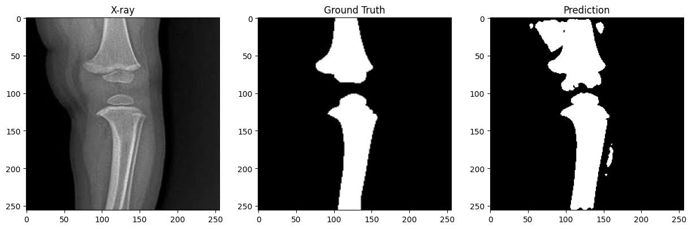

# Bone Segmentation in X-ray Images using U-Net

This project implements a deep learning-based bone segmentation model for X-ray images using PyTorch.

The objective is to segment all bone regions in X-ray images by treating all bones as a single foreground class and the remaining pixels as background.

## Dataset

The dataset was provided externally and contains X-ray images together with bone annotations.

Images and JSON labels:

https://drive.google.com/drive/folders/1b9hX52VOdfKuB-D4eFhWwCW7kM4wiwHL?usp=sharing

Numpy labels:

https://drive.google.com/drive/folders/19ghKdTq1Oh3GbwWhE2_jqMBhuzdd0wdo?usp=sharing

Dataset files are not included in this repository.

## Preprocessing

The original annotation files contained multiple bone categories.

For this project, all bone classes were merged into a single binary segmentation mask:

- Bone pixels → 1
- Background pixels → 0

Binary masks were generated using OpenCV polygon operations.

All images and masks were resized to:

```text
256 × 256
```

### Data Augmentation

To improve generalization performance, online data augmentation was applied during training:

- Random horizontal flip
- Random rotation (-10° to +10°)

Data augmentation was applied only during training and disabled during prediction and evaluation.

## Model

The model uses a U-Net architecture with a pre-trained ResNet34 encoder implemented using the `segmentation_models_pytorch` library.

### Model Configuration

- Architecture: U-Net
- Encoder: ResNet34
- Encoder Weights: ImageNet
- Input Channels: 3
- Output Classes: 1

### Loss Function

Training was performed using a combination of:

- Binary Cross Entropy Loss (BCE)
- Dice Loss

Final loss:

```text
Loss = BCE Loss + Dice Loss
```

## Training Configuration

- Optimizer: Adam
- Learning Rate: 0.0001
- Batch Size: 4
- Epochs: 20
- Random Seed: 42

## Evaluation

The model was evaluated using:

- Dice Score
- Hausdorff Distance
- 5-Fold Cross Validation

### Cross Validation Results

| Fold | Dice Score | Hausdorff Distance |
|------|------------|-------------------|
| Fold 1 | 0.9210 | 21.9192 |
| Fold 2 | 0.9212 | 21.7861 |
| Fold 3 | 0.9196 | 21.9856 |
| Fold 4 | 0.9163 | 18.5836 |
| Fold 5 | 0.9153 | 23.4867 |

### Average Cross Validation Results

- **Average Dice Score:** 0.9187
- **Average Hausdorff Distance:** 21.5523

Detailed fold results are available in:

```text
reports/cross_validation_results.txt
```

## Training / Validation Performance

Using an 80%-20% train-validation split, the model achieved a **Validation Dice Score of 0.9353** after 20 training epochs.

## Prediction Comparison

### Baseline Model


### Improved Model



The improved model significantly reduces segmentation errors and produces boundaries that more closely match the ground-truth masks.

## Conclusion

The combination of transfer learning, data augmentation, and a hybrid BCE + Dice loss function significantly improved segmentation performance.

The model achieved:

- **Average Dice Score:** 0.9187
- **Average Hausdorff Distance:** 21.5523

across 5-fold cross validation.

Additionally, the model achieved a **Validation Dice Score of 0.9353** using an 80%-20% train-validation split.

These results demonstrate strong segmentation accuracy and good generalization performance for bone segmentation in X-ray images.

## Project Structure

```text
bone-segmentation/

├── data/
│   ├── images/
│   └── full_masks/
│
├── outputs/
│   ├── prediction_baseline.png
│   └── prediction_result.png
│
├── reports/
│   └── cross_validation_results.txt
│
├── src/
│   ├── create_masks.py
│   ├── cross_validation.py
│   ├── dataset.py
│   ├── dice_score.py
│   ├── hausdorff.py
│   ├── predict.py
│   ├── train.py
│   ├── train_val.py
│   └── unet.py
│
├── README.md
└── requirements.txt
```

## Requirements

Main libraries used:

- PyTorch
- NumPy
- OpenCV
- Matplotlib
- Scikit-learn
- SciPy
- segmentation-models-pytorch

Install dependencies:

```bash
pip install -r requirements.txt
```

## Running the Project

Generate binary masks:

```bash
python create_masks.py
```

Train the model:

```bash
python train_val.py
```

Run 5-Fold Cross Validation:

```bash
python cross_validation.py
```

Generate prediction outputs:

```bash
python predict.py
```

## Author

Gülsu Naz Koçak
